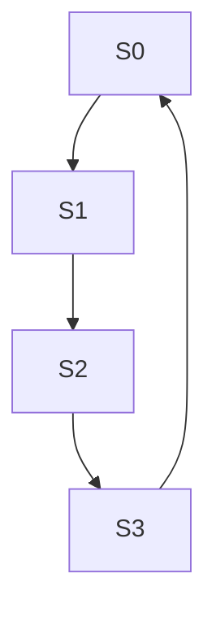

# Traffic Light Controller

This project implements a traffic light controller for a two-way intersection using Verilog. The intersection has four traffic lights, where the lights across from each other switch in sync.

The controller uses a finite state machine (FSM) and a counter to simulate realistic light durations.

---

## Files

- `traffic_light.v` for FSM implementation
- `top_module.v for` the testbench with waveform dumping
- `dump.vcd` is the GTKWave output file
- `traffic_light_waveform.png` is a screenshot of the waveforms simulated using GTKwave

---

## Overview

The system uses four states to control the two traffic light directions (A and B). Each pair alternates between green, yellow, and red lights using a state machine and a timer.

Each state lasts for a fixed number of clock cycles to simulate realistic timing.

---

## FSM States

| State | Alight (A) | Blight (B) | Description             |
|-------|------------|------------|-------------------------|
| S0    | GREEN      | RED        | A is green, B is red    |
| S1    | YELLOW     | RED        | A is yellow, B is red   |
| S2    | RED        | GREEN      | A is red, B is green    |
| S3    | RED        | YELLOW     | A is red, B is yellow   |

---

## Color Encoding

| Color   | Output (2-bit) |
|---------|----------------|
| GREEN   | `00`           |
| YELLOW  | `01`           |
| RED     | `10`           |

---

## State Diagram

# Excitation table
This table shows the required D flip-flop inputs (D1 for MSB, D0 for LSB) to implement the FSM from scratch. For example, to go from state `S0 (00)` to `S1 (01)`, we need to apply `D1=0`, `D0=1` to the flip-flops.

| **Input**  | **Present State** | **Next State** | **Input to D Flip Flop** |
| ------ | ----- | ----- | ----- |
| X | B1 B0 | B1+ B0+ | D1 D0 |
| 0 | 0 0 | 0 0 | 0 0 |
| 0 | 0 1 | 0 1 | 0 1 |
| 0 | 1 0 | 1 0 | 1 0 |
| 0 | 1 1 | 1 1 | 1 1 |
| 1 | 0 0 | 0 1 | 0 1 |
| 1 | 0 1 | 1 0 | 1 0 |
| 1 | 1 0 | 1 1 | 1 1 |
| 1 | 1 1 | 0 0 | 0 0 |
